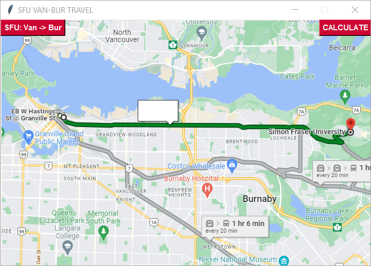

# SFU-campus-time-estimation

Using Transit API, We tried to estimate travel time between the Burnaby and Vancouver campuses.

But there was no appropriate dataset for the project.

The statistical method can be applied to overcome the obstacle.

## Dependency

OS: window

Use the package manager [pip](https://pip.pypa.io/en/stable/) to install SFU-campus-time-estimation.

```bash
pip install beautifulsoup4
pip install requests
pip install lxml
pip install Pillow
```

## Usage

```python
import translink_sfu

stop_bay1 = 51861 # SFU Transit Exchange @ Bay 1

translink_sfu.get_data(stop_bay1) # YIELD XML output

translink_sfu.time_to_leave(soup) # YIELD {BUS_NAME,BUS_TIME}
```

If you run `main.py`, you can see:



## Contributors
Abdullah Naeem

Hoyong Jung

Taehyeong Kim

## Limitations of the project


## License
[MIT](https://choosealicense.com/licenses/mit/)
